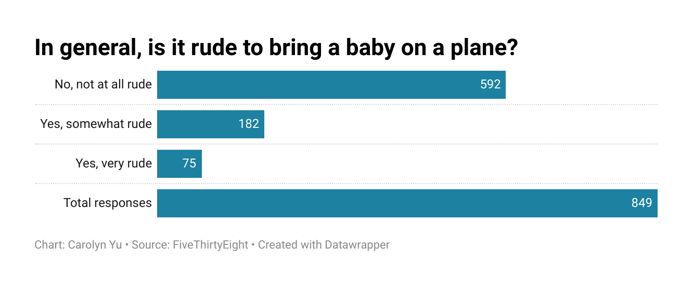

# In general, is it rude to bring a baby on a plane?

### I chose to visualize the question, "In general, is it rude to bring a baby on a plane?" because it taps into a relatable and fairly debated topic regarding etiquette, tolerance, and public space. I found it interesting how polarized people can really be on this issue, and I was curious to see what the majority opinion would be. The chart below shows that most respondents (592 out of 849) do not view it as rude at all, while a smaller number (182) think it is somewhat rude, with only 75 feeling that it is very rude. This reveals that while some frustration exists, the majority of people are understanding of parents traveling with babies.

